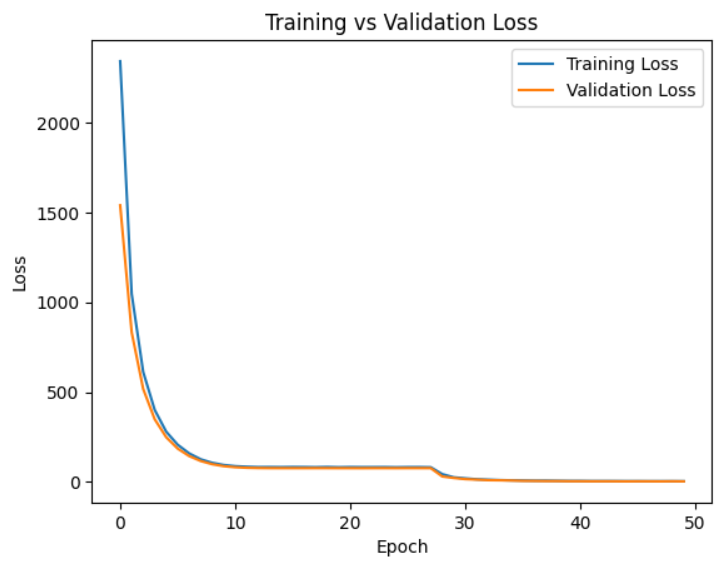
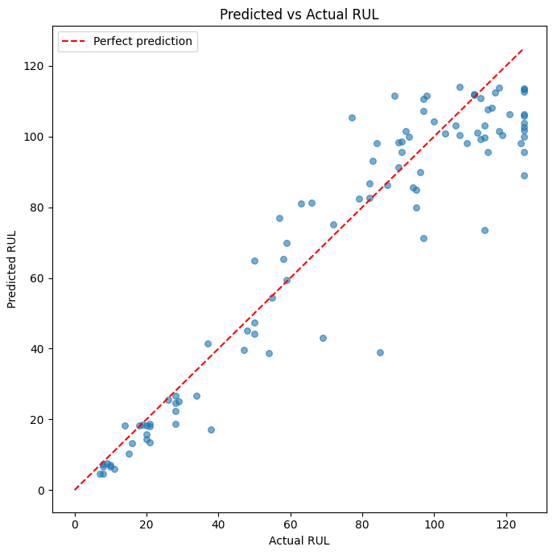
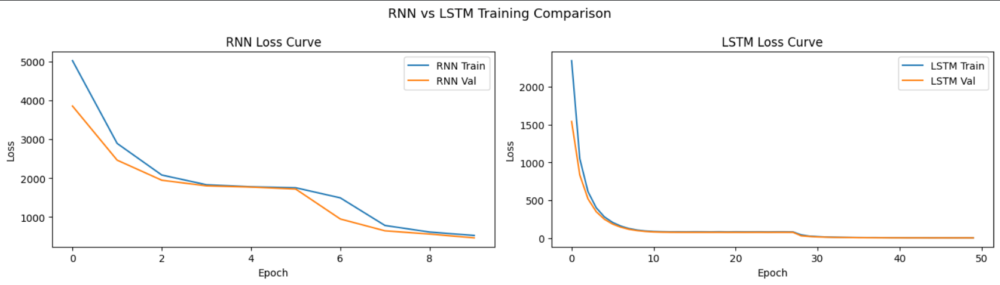

#  Remaining Useful Life (RUL) Prediction using LSTM

##  Overview
This project predicts the Remaining Useful Life (RUL) of machinery using an LSTM-based deep learning model trained on time-series sensor data. It is designed for predictive maintenance to estimate when a machine is likely to fail.

---

##  Problem Statement
In industrial systems, unexpected machine failures lead to downtime and high costs. This project addresses this by predicting failure time using sequential sensor readings.

---

##  Solution Approach
We use a Long Short-Term Memory (LSTM) neural network to capture temporal dependencies in sensor data and predict RUL values.

---

##  Tech Stack
- Python
- TensorFlow / Keras
- NumPy, Pandas
- Scikit-learn
- Matplotlib

---

##  Dataset
- NASA CMAPSS dataset (or your dataset name)
- Multi-sensor time-series engine data

---

##  Model Architecture
- LSTM layers for sequence learning
- Dense layers for regression output
- Loss: Mean Squared Error (MSE)

---

##  Workflow
1. Data preprocessing (cleaning + normalization)
2. Sequence generation for time-series modeling
3. LSTM model training
4. Evaluation using RMSE / MAE
5. Visualization of predictions

---

##  Results
- RMSE: 13.15  
- MAE: 9.44  
- R² Score: 0.892  
- NASA Score: 323.7  
- Improved performance over baseline models

---
##  Project Structure

```text
rul-lstm/
│
├── images/
│   ├── loss_curve.png
│   ├── predicted_vs_actual.png
│   └── rnn_vs_lstm_comparison.png
│
├── notebooks/
│   └── rul_lstm.ipynb
│
├── src/
│   └── rul_lstm.py
│
├── .gitignore
├── README.md
└── requirements.txt
```

##  How to Run

### 1. Clone the repository

```bash
git clone https://github.com/muskan-g72/rul-lstm.git
cd rul-lstm
```

### 2. Install dependencies

```bash
pip install -r requirements.txt
```

### 3. Run the project

```bash
python src/train.py
```

### 4. Explore the notebook

Open the notebook located at:

```text
notebooks/rul_lstm.ipynb
```

##  Visualizations

###  Training Loss Curve
Shows how the model learns over epochs and whether it converges properly.



---

###  Predicted vs Actual RUL
Shows how close the model predictions are to the true Remaining Useful Life values.



---

###  RNN vs LSTM Comparison
Compares baseline RNN performance with LSTM, showing LSTM's superiority in capturing long-term dependencies.


